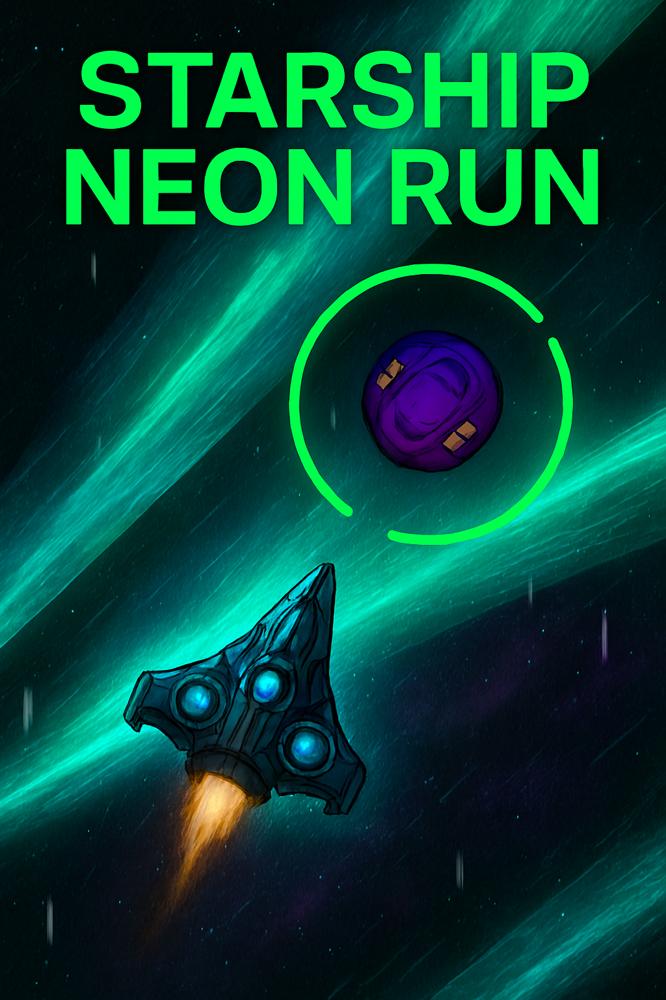

# Starship-Neon-Run


# <span style="color:#00ff6a;">Starship Neon Run</span> 🚀

<div style="display:flex;align-items:center;gap:12px;margin:12px 0;">
  <div style="width:56px;height:56px;border-radius:10px;background:linear-gradient(135deg,#002b1a,#00402a);display:flex;align-items:center;justify-content:center;color:#00ff6a;font-weight:800;font-size:24px;">
    🎮
  </div>
  <div style="font-size:20px;font-weight:800;color:#00ff6a;">Neon Arcade PWA Game</div>
</div>

**Starship Neon Run** — ретро‑футуристическая аркада в неоновом стиле.  
Это <span style="color:#00ff6a;font-weight:bold;">Progressive Web App</span>: можно установить на устройство, запускать оффлайн и управлять как нативным приложением.

---

## <span style="color:#00ff6a;">✨ Возможности PWA</span>

- <span style="color:#00ff6a;">Установка</span> на Android и десктоп через браузер  
- <span style="color:#00ff6a;">Оффлайн‑режим</span> — ресурсы кэшируются через Service Worker  
- <span style="color:#00ff6a;">Иконки</span> в комплекте для PWA и favicon (PNG с прозрачным фоном)  
- <span style="color:#00ff6a;">Media Session</span> — управление воспроизведением из шторки: Play/Pause, Next, Previous  
- <span style="color:#00ff6a;">Fullscreen</span> режим и кастомный splash screen  

---

## <span style="color:#00ff6a;">🚀 Установка</span>

<div style="display:inline-block;padding:10px 14px;border-radius:8px;background:#001f12;color:#00ff6a;font-weight:700;">
Добавить на главный экран
</div>

**Как установить:**
1. Открой сайт в Chrome/Edge на Android или десктопе  
2. В меню браузера выбери «Установить приложение»  
3. После установки игра запускается как отдельное приложение и работает оффлайн  

---

## <span style="color:#00ff6a;">📂 Файлы проекта</span>

### manifest.json
```json
{
  "name": "Starship Neon Run",
  "short_name": "StarshipNeonRun",
  "start_url": "./index.html",
  "display": "fullscreen",
  "background_color": "#000000",
  "theme_color": "#00ff6a",
  "orientation": "portrait",
  "icons": [
    { "src": "icon-192.png", "sizes": "192x192", "type": "image/png" },
    { "src": "icon-512.png", "sizes": "512x512", "type": "image/png" }
  ]
}
```
service-worker.js
```js
const CACHE_NAME = 'starship-neon-cache-v1';
const urlsToCache = [
  './',
  './index.html',
  './styles.css',
  './game.js',
  './manifest.json',
  './icon-192.png',
  './icon-512.png'
];

self.addEventListener('install', event => {
  event.waitUntil(caches.open(CACHE_NAME).then(cache => cache.addAll(urlsToCache)));
});

self.addEventListener('fetch', event => {
  event.respondWith(caches.match(event.request).then(resp => resp || fetch(event.request)));
});
```

Подключение в index.html
В <head>:
```html
<link rel="manifest" href="manifest.json">
<meta name="theme-color" content="#00ff6a">
```

Внизу перед </body>:
```html
<script>
if ('serviceWorker' in navigator) {
  navigator.serviceWorker.register('./service-worker.js')
    .then(reg => console.log('Service Worker registered', reg.scope))
    .catch(err => console.warn('Service Worker failed', err));
}
</script>
```

---

<span style="color:#00ff6a;">🎵 Media Session API</span>

```js
if ('mediaSession' in navigator) {
  navigator.mediaSession.metadata = new MediaMetadata({
    title: currentTrack.title,
    artist: currentTrack.artist,
    artwork: [
      { src: 'icon-192.png', sizes: '192x192', type: 'image/png' },
      { src: 'icon-512.png', sizes: '512x512', type: 'image/png' }
    ]
  });

  navigator.mediaSession.setActionHandler('play', () => audio.play());
  navigator.mediaSession.setActionHandler('pause', () => audio.pause());
  navigator.mediaSession.setActionHandler('previoustrack', () => playPreviousTrack());
  navigator.mediaSession.setActionHandler('nexttrack', () => playNextTrack());
}
```

---

<span style="color:#00ff6a;">📌 Иконки</span>

- icon-192.png — для Android и favicon  
- icon-512.png — для PWA и десктоп‑установок  
- Используйте прозрачный PNG, чтобы избежать белых углов  

```html
<link rel="icon" href="icon-192.png" sizes="192x192" type="image/png">
<link rel="apple-touch-icon" href="icon-192.png">
```

---


